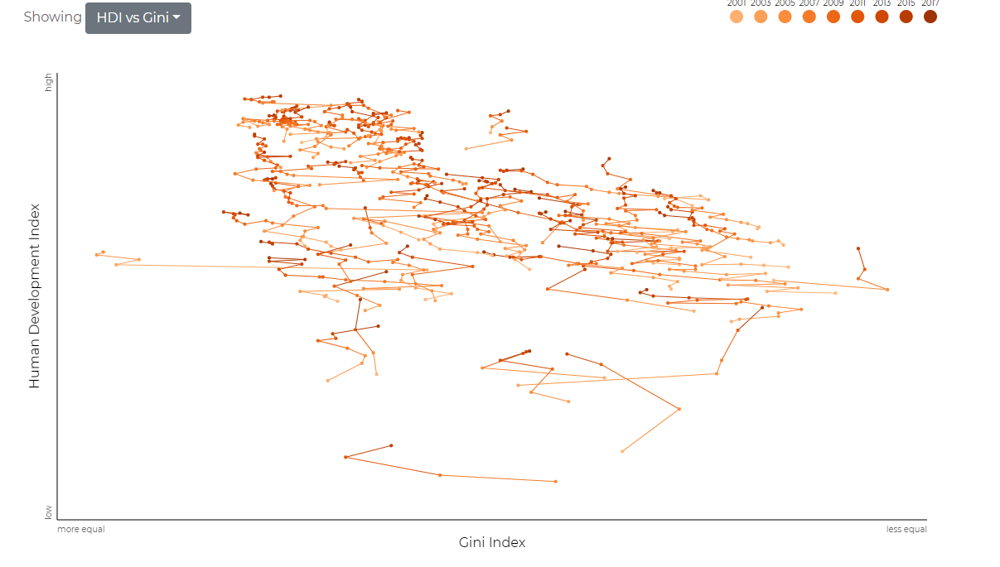

# Inspirations

## Design, layout

### The Pudding (como sempre): Who is the Biggest Pop Star?

Abertura, uso de ilustrações. Width de 40rem, como é o hábito do Russell.

https://pudding.cool/2019/03/pop-music/

## Gráficos

### Jim Valladingham's connected scatterplots

Connected scatterplots, annotations nos small multiples

https://twitter.com/vlandham/status/1088475616452665344

http://vallandingham.me/world_gov_challenge/
